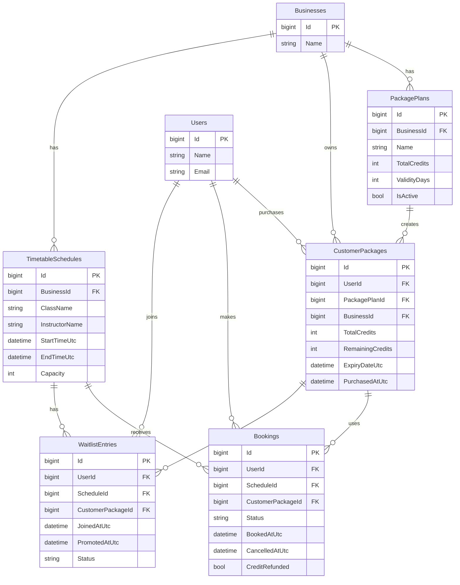

# Database ERD

This document describes the core database relationships for the RezervBooking assessment project.

## Relationship Summary

- One **Business** can have many **PackagePlans**.
- One **Business** can have many **TimetableSchedules**.
- One **User** can own many **CustomerPackages**.
- One **PackagePlan** can be purchased many times, creating many **CustomerPackages**.
- One **CustomerPackage** belongs to one **Business** and tracks the user's remaining credits.
- One **User** can create many **Bookings**.
- One **TimetableSchedule** can have many **Bookings**, subject to its capacity.
- Each **Booking** uses one **CustomerPackage**.
- One **User** can have many **WaitlistEntries**.
- One **TimetableSchedule** can have many **WaitlistEntries** ordered FIFO by `JoinedAtUtc`.
- A **WaitlistEntry** references the **CustomerPackage** that will be revalidated and charged if the user is promoted.

## Important Business Constraints

- `CustomerPackage.BusinessId` must match `TimetableSchedule.BusinessId` when booking.
- `CustomerPackage.RemainingCredits` must be at least 1 for a successful booking or waitlist promotion.
- Active booking count must not exceed `TimetableSchedule.Capacity`.
- Overlapping active bookings for the same user are not allowed.
- Waitlist promotion follows FIFO order.
- Credits are deducted when booking succeeds or when a waitlisted user is promoted.
- Cancellation more than 4 hours before class start refunds one credit.
